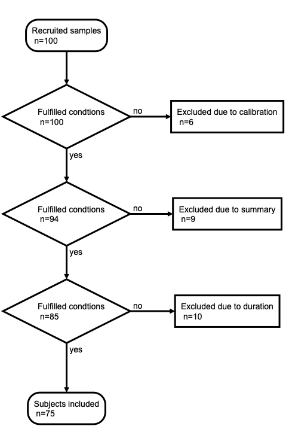

# inclusion_py
[](https://github.com/activityMonitoring/py_inclusion/releases/)


This package provides an easy way to generate the inclusion flowchart generation for participant inclusion for medical and epidemiology analyses. It will reduce the possibility of erroneous reporting in epi research as often the inclusion conditions may vary as the research progresses. Manual flowchart generation is neither efficient or reliable. 

## How to use 
`sample_flowchart.ipynb` has a nice example and the specific format required. We expect the input to be a `Pandas` dataframe of with at least a subject id column called `PID`. All the other columns should contain bolean variables, whehter a particular subject has met the condition based on that criteria
```
sample_df.head()
pid	calibration     summary	    duration
248	True	        True	    True
884	True	        True	    False
793	True	        True	    True
699	False	        True	    True
319	True	        True	    True
```

To generate the flowchart 
```python
from inclusion_py import *
my_order = ['calibration', 'duration', 'summary'] # optional. The default ordering will be used if not specified
gen_flowchart(sample_df, condition_order=my_order)
```
It will generate a script like this:
```
st79=>start: This is not working Ok
cond81=>condition: Fulfilled condtions 
 n=72
cond83=>condition: Fulfilled condtions 
 n=72
cond85=>condition: Fulfilled condtions 
 n=72
e80=>end: Included subjects
op86=>operation: Excluded due to duration
 n= 0
op84=>operation: Excluded due to summary
 n= 0
op82=>operation: Excluded due to calibration
 n= 0

st79->cond81
cond81->
cond81->
cond81(yes)->cond83
cond83->
cond83->
cond83(yes)->cond85
cond85->
cond85->
cond85(yes)->e80
cond85(no)->op86
cond83(no)->op84
cond81(no)->op82
```
The generated graph is based on `flowchart.js`, which can be used to render images in the web.
You can then copy and paste the generated script into [flowchart.js](http://flowchart.js.org]) to generate SVG for your
work. To download svg, you can use [SVG Export](https://chrome.google.com/webstore/detail/svg-export/naeaaedieihlkmdajjefioajbbdbdjgp?hl=en-GB)
on from to easily to that.

A sample figure will look like:



